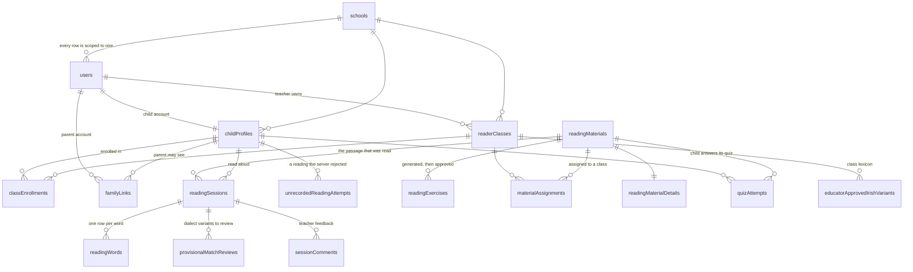
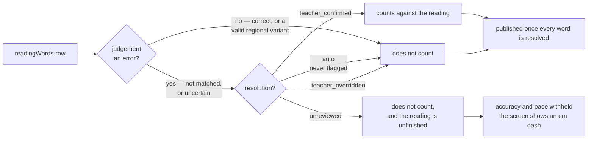
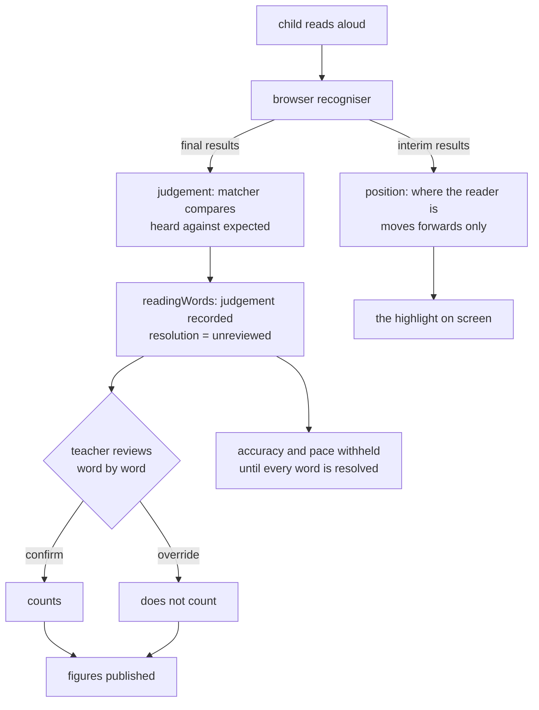
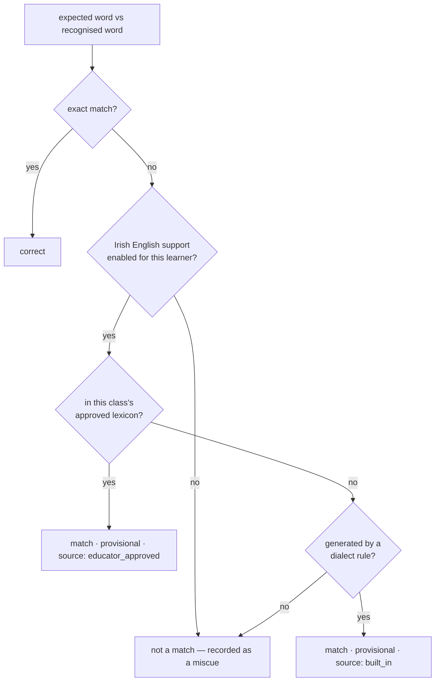

# The data model, the models, and the lexicons

Three things, because they are usually asked about together and they are not the same thing.

1. **The data model** — what is stored, and which tables carry the product's argument.
2. **The models** — every machine-learning model this product touches, what each decides, and
   what each is not allowed to decide.
3. **The lexicons** — there are two, they do different jobs, and only one of them is a
   dictionary.

Companion to `TECH_STACK.md`. Diagrams are Mermaid and render on GitHub.

---

## 1. The data model

### The core: a reading, and who may see it

Twenty-three tables in all. The rest — `learnerReadingSettings`, `weeklyReadingGoals`,
`homePracticeChecklists`, `parentReminders`, `teacherTermPresets`, `schoolBranding` — hang off
the same spine and are left out above so the spine is readable.

### Where a reading is held, twice

A reading is stored in two shapes at once, on purpose.

| | `readingSessions` | `readingWords` |
| --- | --- | --- |
| granularity | one row per reading | one row per word |
| holds | transcript, duration, mode, language support, JSON `wordStates` and `interventions` | `judgement`, `progress`, `resolution`, provenance |
| used for | the child's report, the session list, playback | the teacher's word-by-word review, and every published figure |

The JSON columns came first and are still the source of truth for the screens that read a
whole session. The per-word table is what a teacher's decision is recorded against, and what
accuracy and pace are computed from. Anything that must survive a teacher changing their mind
lives in `readingWords`.

### The three rules the schema enforces

**Every query is scoped to a school.** Every table above carries `schoolId`. The data layer
takes a `TenantScope`, never a raw connection, so a query that forgot the scope is a type
error rather than a data leak.

**No score is stored.** There is no accuracy column. A word counts against a reading only when
its `judgement` is an error **and** its `resolution` is `teacher_confirmed`:

In code that is the whole of `countsAgainstScore`: the judgement must be an error **and** the
resolution must be `teacher_confirmed`. `auto` means the system settled the word without
flagging it at all; `unreviewed` means it was flagged and nobody has looked yet, which is what
holds the figures back.

Because the figure was never written down, overturning a decision changes it. That is the
product's whole claim, expressed as an absence of a column.

**Pace is withheld until the review is finished.** `settledWordsCorrectPerMinute` returns
`null` for a reading with unresolved words, and every surface renders `null` as an em dash.
An absence is not a measurement of zero.

### Identity and time

Session ids are **ULIDs minted in the application** at the moment of capture — a reading knows
its own identity before it is sent, and the leading 48 bits sort in capture order.
`readingSessions.createdAt` is written by the application from the same clock reading used to
judge the device's clock, because database-generated timestamps came back an hour out on a
machine whose timezone is not UTC.

`capturedAt` holds the capturing device's own clock and `capturedAtSource` records whether it
was believed. A tablet an hour out does not lose its reading; it is recorded as a reading the
server timed, with the device's claim kept beside it so the bad clock stays diagnosable.

---

## 2. The models

Four, with very different standing. Only one of them is in the live product path.

| | model | where it runs | what it decides | what it may not decide |
| --- | --- | --- | --- | --- |
| **Speech recognition** | Web Speech API (the browser's own engine) | the child's browser | what words it heard | nothing about the child |
| **Exercise generation** | `gpt-5-mini` via `invokeLLM` | server, on a teacher's click | a draft of vocabulary, questions and an activity, for a teacher to review | nothing reaches a child unapproved |
| **Transcription fallback** | behind a provider-agnostic interface | server | a transcript when audio is sent | unused — no key is set |
| **Forced alignment** | `MMS_FA` (torchaudio) | evaluation harness only | per-word timings for the benchmark | not in the product |

### Speech recognition, and what happens to what it says

The recogniser is the browser's. It is asked for `en-IE`, continuous, with interim results,
and `processLocally` where the browser supports it so a child's voice can stay on the device.

What it returns is **evidence, not a verdict**. It is compared against the passage by
`shared/liveWordStates.ts`, and the comparison never becomes a grade on its own:

Two properties are deliberate and were both bought with defects found the hard way:

- **Interims never colour a word.** They are the recogniser thinking aloud; it revises them
  continuously, and deriving judgement from them turned a word green, then red, then green.
- **A model judgement is never final.** There is no path from the recogniser to a published
  figure that does not pass through a person.

### The language model

Used in exactly one place: `sessions.generateExercises` in the tRPC router, when a teacher
asks for exercises for a passage they uploaded. Four constraints, all in code:

**It is sent the passage and nothing else.** The request is built by
`buildExerciseGenerationRequest({ title, readingLevel, sourceText })`. Passing the whole
`material` object is a compile error, because that record carries teacher, school and storage
fields that must not leave the system.

**Its output is parsed, not trusted.** The response goes through a Zod schema and then
`assertSafeExerciseSet`, which rejects a draft containing any blocked term and rejects any
question whose stated answer is not among its own options. A draft that fails is not shown to
a child; it is returned to the teacher for revision.

**A teacher approves before a child sees it.** Generation writes a draft. `approve` and
`makeAssignable` are separate teacher-only procedures, and the quiz endpoint only serves an
approved, assigned exercise set.

**It never touches a reading.** No model judges whether a word was read correctly. The
language model writes practice material; the matcher compares words; the teacher decides.

---

## 3. The lexicons

Two, and they are often confused because both are word lists.

### 3.1 The dialect lexicon — generated, not stored

`shared/dialectSupport.ts` does not hold a dictionary. It holds **rules**, and generates the
plausible Irish-English pronunciations of a word on demand:

| feature | rule | example |
| --- | --- | --- |
| TH-stopping (voiceless) | `th` → `t` | thin → tin |
| TH-stopping (voiced) | `th` → `d` on a known set of function words | that → dat |
| G-dropping | `-ing` → `-in`, except monosyllables like *king* | running → runnin |
| TH cluster reduction | listed irregulars | through → true |
| Cot-caught merger | listed irregulars | caught → cot |

The exceptions matter as much as the rules. *King*, *thing* and *ring* are not g-dropped
because there is no `-ing` suffix to drop, and voiced TH-stopping applies only to a closed set
of function words rather than to every `th`, so *think* does not become *dink*.

`irishEnglishVariants("through")` returns `{ true → th-cluster, tru → th-cluster }`. Nothing is
stored, and it is computed per word as the matcher needs it.

### 3.2 The class lexicon — stored, and owned by a teacher

`educatorApprovedIrishVariants` is a real table: `(classId, expectedWord, recognisedVariant)`,
unique on all three, scoped to a school. This is a lexicon a **teacher builds for their own
class** by confirming variants the built-in rules did not predict.

### How the two are consulted

`matchExpectedReadingWord` tries them in order, and the order is the policy:

**A provisional match counts as read correctly and is sent to teacher review.** It is written
to `provisionalMatchReviews` with its source, and it never counts as an error. The teacher can
confirm it — which can add it to the class lexicon — or dismiss it.

This is the fairness claim made mechanical rather than asserted. A child who says *dat* for
*that* has read the word correctly in her dialect. The software records that it heard a
variant, says which rule predicted it, and asks. It does not mark her down and it does not
silently "correct" her.

**What the dialect feature is not.** No per-child accent, dialect or EAL label is stored
anywhere. The support setting is a per-learner *reading setting* a teacher chooses
(`learnerReadingSettings.languageSupport`), not an inferred property of the child, and the
variant records belong to a class, not to a person.

### 3.3 The vocabulary lexicon — per passage, teacher-approved

Separate from both of the above, and worth being precise about because the names invite a
wrong assumption.

An `ExerciseSet` on a passage holds `vocabulary: { word, childFriendlyMeaning }[]`, generated
by the language model. **It is shown to the teacher**, in the materials studio and the
approval workflow, as part of the draft they review. The child's quiz endpoint returns only
the `activity` line and the `questions` — the vocabulary list is not in that payload.

The child *does* see a screen called **Vocabulary & Sound Warm-Up** before reading, and its
three focus words are **not** from this lexicon: they are taken from the passage itself, the
first three distinct words of six letters or more. No model chose them.

Neither list is a matching aid. The matcher never consults either one.

---

## 4. The one-line summary of all three

The database stores what happened and who decided; the models propose and never conclude; the
lexicons say which differences are not mistakes — one by rule, one by a teacher, and neither
by guessing anything about the child.

---

| see also | |
| --- | --- |
| `TECH_STACK.md` | the stack layer by layer |
| `RUNNING_LOCALLY.md` | getting it running and testing it |
| `drizzle/schema.ts` | the tables, with the reasoning in comments |
| `shared/dialectSupport.ts` | the dialect rules and the matcher |
| `shared/readingWordScore.ts` | what counts, and when |
| `ENGINE_PROPOSAL.md` | the speech-engine evaluation and the open findings |
